# A LoRA-Based Teaching Assistant for Discrete Mathematics: Data Construction, Parameter-Efficient Fine-Tuning, and Experimental Analysis

- **Project group:** Group 6
- **Members:** Muka Leng, Yuhui Yang, and Yutianya Wang
- **Responsibilities:** Muka Leng was responsible for QA generation, Yutianya Wang for QA filtering, and Yuhui Yang for model training and parameter experiments.

## Abstract

This project develops a teaching-assistant model for discrete mathematics that is expected to answer course questions correctly and to present its answers in a concise, accurate, and student-appropriate style. Ten Markdown lecture notes from the Southern University of Science and Technology CS201 Discrete Mathematics course are used as the knowledge source. Chinese question-answer pairs are generated with DeepSeek-V4-Flash and processed through length constraints, BGE-base-zh-v1.5 relevance and duplication filtering, Qwen-3.6-27B quality scoring, and five-fold semantics-preserving augmentation. On the modeling side, the project compares Qwen3.5-0.8B, 2B, and 4B, multiple LoRA ranks, partial-layer tuning, and dropout settings, and ultimately selects Qwen3.5-2B with full-layer LoRA. The final run uses $r=4$, $\alpha=8$, and $\mathrm{dropout}=0.5$. It trains only 1,253,376 of 1,883,078,464 parameters, or 0.0666%. After 15 epochs on 48,075 augmented QA pairs, fixed-test loss decreases monotonically from 0.902961 at epoch 1 to 0.840197 at epoch 15, while perplexity decreases from 2.466896 to 2.316823. The results indicate that low-rank adaptation, semantic augmentation, and strong dropout can jointly improve domain-specific response style and fixed-test fitting at low training cost. However, the experiment does not yet include independent human assessment or a strictly non-augmented, non-overlapping test set; conclusions about mathematical correctness must therefore remain cautious.

## 1. Experimental Background and Objectives

### 1.1 Background

General-purpose large language models can often explain elementary discrete mathematics, but their answers may be verbose, stylistically inconsistent, or insufficiently aligned with a particular course. A course teaching assistant must generate fluent text while satisfying the following domain constraints:

- **Correctness:** mathematical definitions, theorems, formulas, and derivations should be correct.
- **Course alignment:** answers should cover logic and proofs, sets and functions, algorithmic complexity, number theory and cryptography, induction and recursion, counting, relations, graphs and trees, and course review.
- **Pedagogical usability:** explanations should be clear, accessible to students, and include necessary derivation steps.
- **Style constraint:** answers should be concise and accurate, without irrelevant preamble or redundant elaboration.
- **Training economy:** domain adaptation should be achieved under limited computational resources through parameter-efficient fine-tuning.

### 1.2 Objectives

The project has five objectives:

1. Automatically construct a Chinese QA dataset spanning multiple cognitive categories from ten discrete-mathematics lecture notes.
2. Build an interpretable, multi-stage cleaning pipeline that reduces overlong samples, irrelevant answers, semantic duplication, and low-quality responses.
3. Compare the effects of base-model size, LoRA rank, layer position, dropout, and augmentation on capacity and generalization.
4. Select a final configuration that balances training cost, overfitting risk, and response quality.
5. Evaluate fine-tuning through fixed-test loss and a qualitative before-and-after comparison.

## 2. Project Architecture

### 2.1 Model Architecture Analysis

The final training backbone is Qwen3.5-2B. Rather than repeatedly stacking a single attention mechanism, the model uses a distinctive hybrid architecture that periodically alternates Linear Attention with full Self-Attention. Its 24-layer text backbone consists of six identical Mixed Attention Blocks connected sequentially, with each block following this layer order:

```text
Input
  -> [Linear Attention
      -> Linear Attention
      -> Linear Attention
      -> Full Self-Attention] × 6
  -> Output
```

Let the $i$-th Mixed Attention Block be denoted by $\mathcal{B}_i$. Its structure is:

$$
\mathcal{B}_i=
[\mathrm{LA}_{4i-3},\mathrm{LA}_{4i-2},
\mathrm{LA}_{4i-1},\mathrm{SA}_{4i}],
\quad i=1,2,\ldots,6.
$$

The 24-layer text backbone therefore contains 18 Linear Attention layers and 6 Full Self-Attention layers, with a full-attention layer appearing at every fourth layer. The two attention types expose different projection interfaces:

| Attention type | Number of layers | Layer positions | Principal projection modules |
| --- | ---: | --- | --- |
| Linear Attention | 18 | The first three layers of each Mixed Attention Block | `in_proj_qkv`, `out_proj` |
| Full Self-Attention | 6 | Layers 4, 8, 12, 16, 20, and 24 | `q_proj`, `k_proj`, `v_proj`, `o_proj` |

Linear Attention combines the Query, Key, and Value input mappings in `in_proj_qkv`, whereas Full Self-Attention uses separate `q_proj`, `k_proj`, and `v_proj` modules. This heterogeneous projection structure directly determines how parameter-efficient adaptation must be injected. Applying LoRA only to the conventional Self-Attention modules `q_proj`, `k_proj`, `v_proj`, and `o_proj` would leave the Linear Attention layers, which constitute 75% of the backbone, unadapted. The final configuration therefore targets `q_proj`, `k_proj`, `v_proj`, `o_proj`, `in_proj_qkv`, and `out_proj` across all 24 layers, allowing both attention pathways to undergo domain adaptation.

The architecture also affects fine-tuning-method compatibility. Model input first passes through three consecutive Linear Attention layers whose cache representation and module interfaces differ from those of standard Self-Attention. The `past_key_values` mechanism required by PrefixFT cannot directly satisfy the current linear-attention cache interface, and the PrefixFT and Adapter implementations both encountered unresolved compatibility problems in this hybrid stack. The final training therefore excludes both methods and uses LoRA, which can act directly on the projection matrices listed above.

### 2.2 Project Workflow

Starting from the course materials, the project sequentially performs data construction, quality control, semantic augmentation, model training, and effect evaluation:

```text
CS201 Markdown lecture notes
  -> QA generation with DeepSeek-V4-Flash
  -> length filtering
  -> BGE QA-relevance filtering and question deduplication
  -> Qwen-3.6-27B quality scoring
  -> five-fold QA augmentation
  -> parameter-efficient Qwen3.5 fine-tuning
  -> fixed-test evaluation and interactive validation
```

This workflow converts the source notes into structured QA pairs, progressively controls data quality through rules, semantic models, and large-model scoring, broadens expression coverage for each knowledge item, and finally evaluates fine-tuning with fixed-test metrics and interactive cases.

### 2.3 Project Modules

The implementation is divided into data, model, training, and evaluation modules:

| Module or path | Function |
| --- | --- |
| [`model/`](model/) | Stores local base models and related model files required by the experiments. |
| [`QA_Gen/data/Lecture/`](QA_Gen/data/Lecture/) | Stores the ten CS201 Markdown lecture notes used as the original knowledge source for QA construction. |
| [`QA_Gen/QA_Gen.py`](QA_Gen/QA_Gen.py) | Parses lecture-heading levels and invokes DeepSeek-V4-Flash to generate raw QA pairs. |
| [`QA_Gen/QA_Filter.py`](QA_Gen/QA_Filter.py) | Performs structural and length filtering, BGE similarity computation, question deduplication, and data statistics. |
| [`QA_Gen/QA_Scorer.py`](QA_Gen/QA_Scorer.py) | Uses Qwen3.6-27B to score and filter QA pairs on a 0--5 scale. |
| [`QA_Gen/QA_Augmentation.py`](QA_Gen/QA_Augmentation.py) | Generates four semantically equivalent rewrites for each original QA pair to construct the five-fold corpus. |
| [`Train/main.py`](Train/main.py) | Handles data splitting, training, dynamic validation resplitting, fixed-test evaluation, and checkpoint saving. |
| [`Train/config.yaml`](Train/config.yaml) | Centralizes model paths, data paths, training hyperparameters, and the fine-tuning method. |
| [`Train/utils/LoRALayer.py`](Train/utils/LoRALayer.py) | Defines LoRA rank, scaling factor, dropout, target modules, and partial-layer selection. |
| [`Train/utils/PrefixFTLayer.py`](Train/utils/PrefixFTLayer.py) | Implements Prefix Tuning for method-compatibility experiments. |
| [`Train/utils/AdapterFinetuningLayer.py`](Train/utils/AdapterFinetuningLayer.py) | Implements bottleneck adapters for method-compatibility experiments. |
| [`Train/logs/`](Train/logs/) | Stores training logs, test metrics, and experiment records for different hyperparameter settings. |
| [`Eval/eval.py`](Eval/eval.py) | Loads the base model and LoRA adapter for interactive QA and qualitative validation. |

## 3. Dataset Introduction

### 3.1 Data Source

The source data consist of ten Markdown lecture notes for the Southern University of Science and Technology CS201 Discrete Mathematics course, stored in [`QA_Gen/data/Lecture/`](QA_Gen/data/Lecture/). The chapters cover:

1. Course information and overview
2. Logic and proofs
3. Sets and functions
4. Complexity of algorithms
5. Number theory and cryptography
6. Induction and recursion
7. Counting
8. Relations
9. Graphs and trees
10. Review

### 3.2 QA Generation Method

Approximately 1,000 QA pairs are targeted for each chapter at two context granularities:

- **Whole-chapter generation, 30%:** 300 cross-topic questions with quotas `[definition/explanation 100, logical reasoning 50, definitional relations 100, practical application 50]`.
- **Second-level-heading generation, 70%:** 700 fine-grained questions with quotas `[definition/explanation 100, logical reasoning 300, definitional relations 200, practical application 100]`, divided by integer allocation across Markdown `##` sections.

DeepSeek-V4-Flash is used for generation. Question generation disables reasoning and uses `temperature=1.2` to encourage diversity; answer generation enables high-effort reasoning and does not set temperature. Prompts require Chinese-only output, prohibit unnecessary prefixes and references such as “according to the teaching material,” and exclude questions about course grading. Generating approximately 1,000 QA pairs consumes 42,616,618 tokens: 36,071,040 cached input tokens, 2,647,389 uncached input tokens, and 3,898,189 output tokens.

### 3.3 Data Scale

The data-processing and training stages have the following scale:

| Stage | QA pairs | Retention from previous stage | Description |
| --- | ---: | ---: | --- |
| Raw generated data | 9,905 | -- | Raw QA generated from ten lecture-note chapters. |
| After length filtering | 9,881 | 99.76% retained | 24 pairs of at least 1,000 characters are removed. |
| After QA-relevance filtering | 8,481 | 85.83% retained | 1,400 low-relevance pairs are removed. |
| After question deduplication | 7,431 | 87.62% retained | 1,050 duplicate questions are removed. |
| After quality-score filtering | 6,227 | 83.80% retained | 1,204 low-quality pairs are removed; overall retention is 62.87%. |
| Five-fold augmented data | 48,075 | -- | The final corpus contains original QA pairs and four semantic rewrites. |
| Final train/validation pool | 38,460 | 80% of total | 33,652 train and 4,808 validation samples per epoch. |
| Fixed test set | 9,615 | 20% of total | Unchanged across all 15 epochs. |

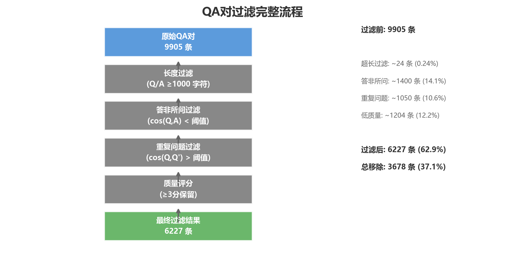

The raw-data scale is slightly below the theoretical 10,000 because per-section quotas use integer division, causing small variations according to chapter structure.

The quality-filtered data are used to analyze cleaning effectiveness. The five-fold corpus used for final training is generated by augmenting the original chapter-level QA files; its size is therefore not five times 6,227.

### 3.4 Length Characteristics

Questions average approximately 40 characters, and answers average approximately 200 characters. Twenty-four samples satisfy $\max(|Q|,|A|)\geq 1{,}000$. Category-level patterns are:

- definition/explanation questions are short with relatively long explanatory answers;
- logical-reasoning answers contain more complete derivations;
- practical-application questions and answers have medium length;
- definitional-relation questions are short and emphasize conceptual comparison.

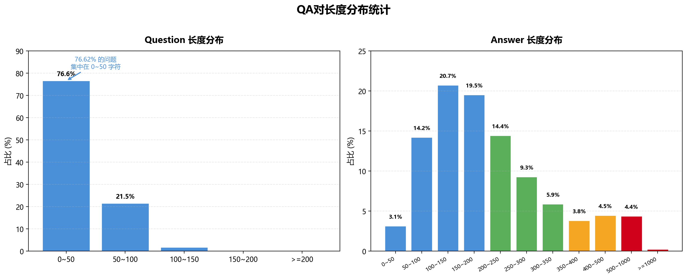

### 3.5 Cleaning Steps

#### 3.5.1 Structural and Length Filtering

The pipeline first checks that `question` and `answer` exist and are non-empty. The experiment uses 1,000 characters as the overlength threshold to reduce inefficient long samples. The current implementation interactively supports separate maximum lengths for the pair, question, and answer.

#### 3.5.2 BGE QA-Relevance Filtering

BGE-base-zh-v1.5 encodes preprocessed questions and answers, after which the pipeline computes:

$$
\cos(Q,A)=\frac{\mathbf{q}^{\mathsf T}\mathbf{a}}
{\lVert\mathbf{q}\rVert_2\lVert\mathbf{a}\rVert_2}.
$$

By default, $\cos(Q,A)<0.5$ is treated as insufficient QA relevance. This stage removes 1,400 QA pairs, approximately 14.1% of its input; most retained pairs lie between 0.6 and 0.9.

#### 3.5.3 BGE Duplicate-Question Filtering

Pairwise $\cos(Q,Q')$ is computed within each question type. By default, $\cos(Q,Q')>0.85$ denotes duplication, and the earlier question is retained. This stage removes 1,050 duplicate questions, approximately 10.6% of its input. Building the pairwise similarity matrix has approximately $O(n^2)$ time and memory complexity.

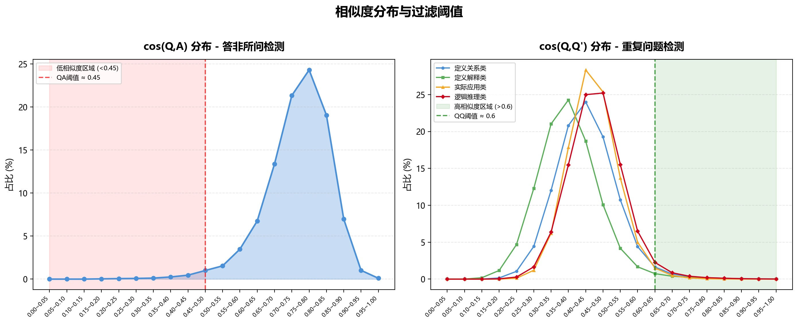

#### 3.5.4 Qwen Quality Scoring

Qwen3.6-27B assigns an integer score from 0 to 5 according to accuracy, completeness, logical coherence, clarity, and answer detail:

- 5: fully correct, complete, clear, and directly usable for teaching;
- 4: essentially correct with minor deficiencies;
- 3: partially correct, with small errors that do not obstruct core understanding;
- 2: substantial errors and inaccurate core information;
- 1: entirely wrong or irrelevant;
- 0: invalid content.

The scorer uses batch size 16 and attempts 4-bit quantized loading before falling back to ordinary loading. The filtering threshold is $\mathrm{score}\geq 3$. Approximately 75% of samples in the quality-score analysis meet the retention criterion; in the complete filtering pipeline, this stage removes 1,204 low-quality QA pairs and produces 6,227 candidate pairs.

### 3.6 Data Augmentation

Because semantic deduplication produces a dispersed question distribution, a randomly selected test set may include phrasings never observed during training. Each original QA is therefore expanded to five items: the original plus four DeepSeek-V4-Flash rewrites with the same meaning and different wording. The sampled comparison is:

| Data | Sampled pairs | Mean cosine | Median | Standard deviation | $P(\cos>0.75)$ |
| --- | ---: | ---: | ---: | ---: | ---: |
| Original $n=1$ | 6,900 | 0.4148 | 0.4114 | 0.0824 | 0.0027 |
| Augmented $n=5$ | 10,000 | 0.4620 | 0.4509 | 0.1065 | 0.0276 |

Augmented data have a mean similarity of 0.4620, higher than the original data's 0.4148, indicating that augmentation increases semantic density among alternative formulations of the same knowledge. Five-fold augmentation consumes 41,949,275 tokens: 20,564,352 cached input, 7,664,914 uncached input, and 13,720,009 output tokens.

## 4. Model and Fine-Tuning Strategy

### 4.1 Model Selection

The preliminary comparison includes Qwen3.5-0.8B, 2B, and 4B. Qwen3.5 is selected for its Chinese generation capability, causal-language-modeling interface, and range of model sizes. Qwen3.5-2B is selected for the final run because:

- 0.8B has the lowest cost but weaker capacity under comparable trainable-parameter budgets;
- 4B has stronger capacity but higher computational cost and earlier test-loss deterioration at high rank;
- 2B provides a practical compromise among cost, capacity, and generalization.

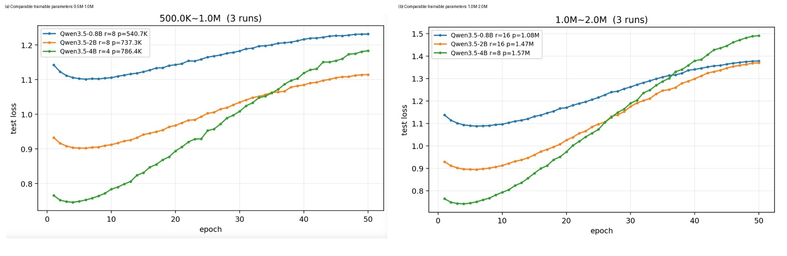

### 4.2 Fine-Tuning Method

The project implements LoRA, Prefix Tuning, and bottleneck adapters. Qwen3.5's hybrid linear attention changes cache and attention interfaces, making PrefixFT incompatible with the current model; unresolved problems also occurred in the early Adapter experiment. LoRA is therefore used for the final system. Its update is:

$$
W' = W + \frac{\alpha}{r}BA,
$$

where the base weight $W$ is frozen and only low-rank matrices $A$ and $B$ are trained. This substantially reduces memory and checkpoint size.

### 4.3 Training Data Construction

The training script formats each sample as a user message containing:

```text
问题类型：<type>
问题：<question>
```

The answer is the assistant response. Loss is applied only to answer tokens, while prompt labels are set to `-100`. Maximum sequence length is 1,024 tokens. Data are split 70%/10%/20% with seed 42. The test set remains fixed, whereas the train and validation subsets are reshuffled with a new deterministic seed after every epoch evaluation.

### 4.4 Preliminary Search Space

The parameter search space includes:

- base models: 0.8B, 2B, and 4B;
- LoRA ranks: 4, 8, 16, 32, and 64;
- $\alpha=2r$;
- dropout: `[0, 0.02, 0.05, 0.1, 0.25, 0.33, 0.5]`;
- all-layer tuning and partial tuning of 24, 12, or 6 attention blocks at the input or output side.

For comparable trainable-parameter budgets, the experiments use:

| Base model | Smaller parameter group | Larger parameter group |
| --- | --- | --- |
| Qwen3.5-0.8B | $r=8$, 0.5407M | $r=16$, 1.08M |
| Qwen3.5-2B | $r=8$, 0.7373M | $r=16$, 1.47M |
| Qwen3.5-4B | $r=4$, 0.7864M | $r=8$, 1.57M |

The results indicate that larger base models generally provide stronger representational capacity but require more computation. The test curves additionally show that larger models and higher ranks overfit earlier, so capacity does not directly imply superior final generalization.

### 4.5 LoRA Rank and Overfitting

Within a fixed base model, increasing rank accelerates training-loss reduction and therefore increases adaptation capacity. However, test loss rises more strongly after its minimum. The overfitting indicator is defined as:

$$
R_{\text{train/test}}=
\lg\left(
\frac{L_{\text{test,final}}}{L_{\text{train,final}}}
\right).
$$

This ratio grows approximately exponentially with trainable parameter count. In the parameter table, Qwen3.5-4B grows from 786,432 parameters (0.0187%) at $r=4$ to 12,582,912 (0.2983%) at $r=64$; Qwen3.5-0.8B grows from 270,336 (0.0359%) to 4,325,376 (0.5716%). A low rank is consequently selected.

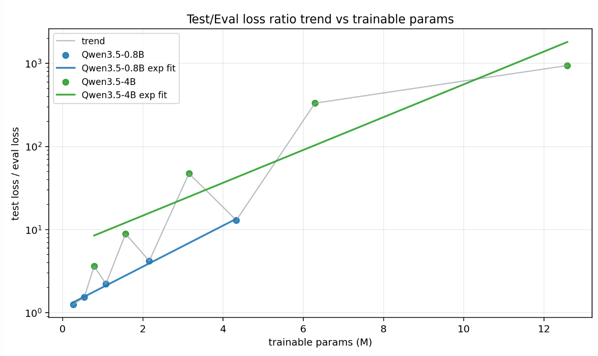

### 4.6 Partial-Layer Fine-Tuning

Partial-layer experiments use Qwen3.5-2B, $r=4$, and $\mathrm{dropout}=0$, applying LoRA only to 24, 12, or 6 attention blocks near the input or output. Top-6 performs similarly to End-12, suggesting greater per-layer effectiveness near the input. Nevertheless, partial tuning is inferior to all-24-layer tuning in both training and test loss.

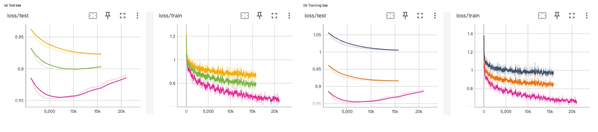

### 4.7 Dropout

Dropout experiments compare $r\in\{4,8,16\}$ on Qwen3.5-2B. The experiments show that $r=8,\ \mathrm{dropout}=0.5$ has training loss comparable to $r=4,\ \mathrm{dropout}=0$ and higher than the same-rank model without dropout. Dropout therefore deliberately trades fitting capacity for generalization. Higher-rank test curves show stronger overfitting, motivating the final choice $r=4,\ \mathrm{dropout}=0.5$.

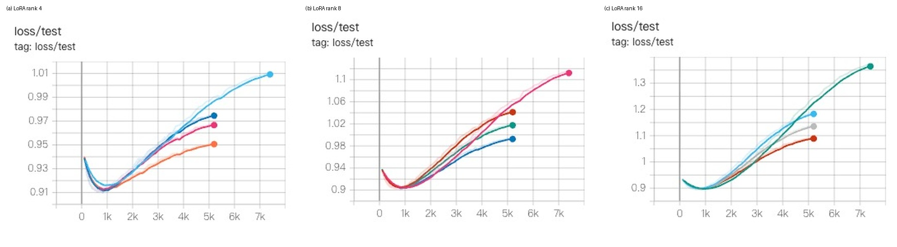

### 4.8 Final Fine-Tuning Settings

The executed final configuration is:

| Parameter | Setting |
| --- | --- |
| Base model | Qwen3.5-2B |
| Method | LoRA for causal language modeling |
| Target layers | All 24 layers |
| Target modules | `q_proj`, `k_proj`, `v_proj`, `o_proj`, `in_proj_qkv`, `out_proj` |
| Rank / Alpha | 4 / 8 |
| Scaling | Standard $\alpha/r$ |
| LoRA dropout | 0.5 |
| Initialization | Gaussian |
| Trainable parameters | 1,253,376 / 1,883,078,464 (0.0666%) |
| Epochs | 15 |
| Per-device batch size | 8 |
| Gradient accumulation | 4; effective single-GPU batch approximately 32 |
| Learning rate | $5\times10^{-5}$ |
| Numerical precision | BF16 |
| Maximum length | 1,024 tokens |
| Data split | 70%/10%/20%, seed 42 |
| Logging/saving | Log every 10 steps; save every 500; retain at most 3 periodic checkpoints |

The final training run uses LoRA dropout 0.5 together with $r=4$ and $\alpha=8$.

## 5. Experimental Results

### 5.1 Augmentation and Generalization

The experiment first compares $n=1$ and $n=5$ using similar numbers of training samples under Qwen3.5-2B, $r=4$, $\alpha=8$, and $\mathrm{dropout}=0$. The augmented data achieve a lower minimum test loss, indicating improved robustness to alternative phrasings. With the complete augmented set and dropout enabled, the combination of augmented data and $\mathrm{dropout}=0.5$ produces the most stable test trajectory.

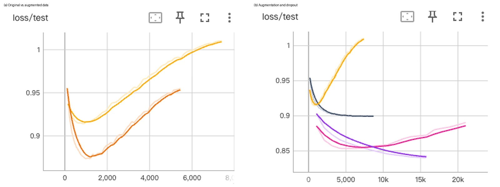

### 5.2 Final Training Metrics

The final run completes 15,780 optimization steps in 26,812.01 seconds, approximately 7.45 hours, at 18.827 training samples/s. Final metrics are:

| Metric | Value |
| --- | ---: |
| Final training loss | 0.845818 |
| Final dynamic-validation loss | 0.773313 |
| Fixed-test loss at epoch 1 | 0.902961 |
| Fixed-test loss at epoch 15 | 0.840197 |
| Relative fixed-test-loss reduction | 6.95% |
| Fixed-test perplexity at epoch 1 | 2.466896 |
| Fixed-test perplexity at epoch 15 | 2.316823 |
| Relative perplexity reduction | 6.08% |
| Final test throughput | 71.969 samples/s |
| Total FLOPs | $1.2169\times10^{18}$ |

Fixed-test loss decreases throughout all 15 epochs and does not exhibit the pronounced late-stage reversal observed in preliminary non-augmented experiments. This supports the claim that augmentation plus strong dropout reduces overfitting under the current split. It does not prove generalization to entirely independent course questions, because paraphrases of the same original item may be randomly assigned to both training and test sets.

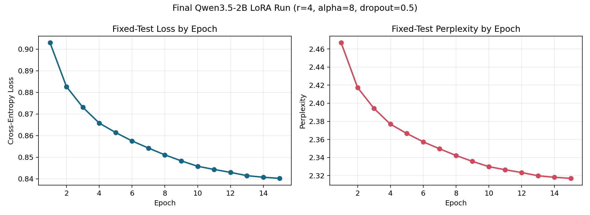

### 5.3 Effect Before and After Fine-Tuning

The experiment compares the base and fine-tuned models on the same question:

> What roles do constants $C$ and $k$ play when proving an upper bound in Big-O notation?

#### 5.3.1 Before Fine-Tuning

The base model gives a verbose answer that exceeds the 512-token output limit. Its response contains substantial preamble and repetition rather than presenting the central roles of the two constants in a compact structure.

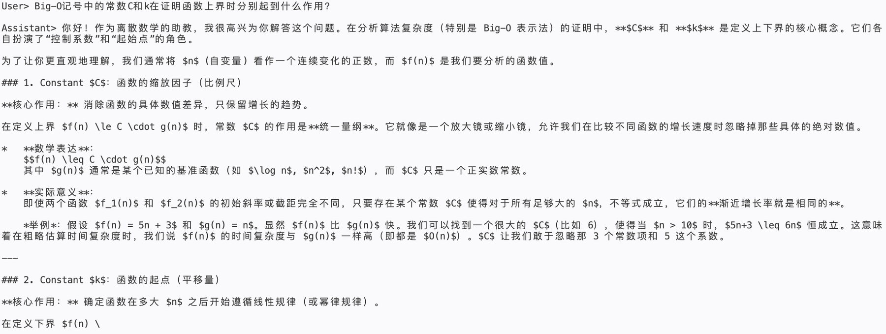

#### 5.3.2 After Fine-Tuning

The fine-tuned model responds much more briefly and directly identifies $k$ as the threshold beyond which the inequality holds and $C$ as the positive multiplicative constant controlling the relative upper bound.

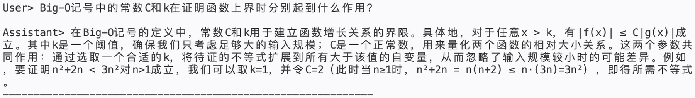

Together, the two results show that fine-tuning reduces irrelevant preamble and produces a more concise and accurate response with more focused mathematical notation and derivation structure. This demonstrates effective adaptation to the target course-answering style. To ensure reliability in teaching scenarios, broader evaluation should still examine the consistency of constants, boundary conditions, and derivation details across more problem types.

## 6. Result Analysis

### 6.1 Effective Factors

1. **Low rank controls capacity.** High rank substantially lowers training loss but enlarges the train-test gap; $r=4$ is more appropriate for the current data scale.
2. **All-layer adaptation outperforms partial adaptation.** Top-6 has good per-layer efficiency, but all-24-layer LoRA gives better training and test results.
3. **Dropout provides regularization.** $\mathrm{dropout}=0.5$ constrains training fit, but together with augmentation it yields continuously decreasing fixed-test loss.
4. **Semantic augmentation broadens expression coverage.** Five synonymous formulations increase local semantic density and encourage invariance to wording.
5. **Parameter efficiency is high.** Only 0.0666% of parameters are updated, and the adapter weights are approximately 4.8 MB, far smaller than a full fine-tuned model.

### 6.2 Project Limitations and Possible Improvements

1. **Mathematical preprocessing may discard essential information.** Current similarity preprocessing removes some LaTeX bracket content and mathematical symbols, which may alter formula semantics. A formula-preserving normalization procedure could encode natural language and mathematical expressions separately and then fuse the two representations for relevance assessment.
2. **Pairwise deduplication is computationally expensive.** A complete similarity matrix has approximately $O(n^2)$ time and memory complexity and does not scale well. Vector databases, approximate nearest-neighbor retrieval, or bucketed clustering could restrict comparisons to candidate neighbors.
3. **The evaluation metrics are limited.** Cross-entropy loss and qualitative examples do not fully measure mathematical correctness, completeness, or pedagogical style. Future evaluation should add instructor ratings, step-level correctness, formula consistency, response length, repetition rate, and semantic comparison with reference answers.
4. **The interactive system lacks explicit knowledge-boundary control.** The model may answer questions outside the course scope or express unwarranted confidence. Course-scope detection, retrieval augmentation, confidence estimation, and refusal behavior could improve deployment reliability.

### 6.3 Interpretation

The reduction in fixed-test loss from 0.902961 to 0.840197 shows that the model increasingly fits the answer-token distribution of the fixed test samples over training. In contrast to preliminary non-augmented runs whose test loss first falls and then rises, the final curve supports the regularizing effect of augmentation and dropout under the present random split. The final training loss, 0.845818, being higher than the final dynamic-validation loss, 0.773313, does not imply an anomalous validation set: dropout is active only during training, training loss is averaged over the entire run, and the validation subset is resampled each epoch. Fixed-test loss remains the most reliable trend measure.

## 7. Experimental Summary

The project implements an end-to-end path from lecture notes to a domain teaching assistant: DeepSeek-V4-Flash generates four types of QA pairs; length rules, BGE semantic similarity, and Qwen3.6-27B scoring clean the data; five-fold semantic rewriting broadens question coverage; and Qwen3.5 models are evaluated across model scale, LoRA rank, partial-layer tuning, dropout, and augmentation. Balancing capacity, computational cost, and overfitting, the final system uses Qwen3.5-2B with LoRA on all 24 layers, $r=4$, $\alpha=8$, and $\mathrm{dropout}=0.5$.

This configuration completes 15 epochs on 48,075 augmented samples while updating only 0.0666% of model parameters. Fixed-test loss decreases by 6.95%, and response style becomes markedly shorter and more direct. The resulting system is an effective prototype for course-domain adaptation.
